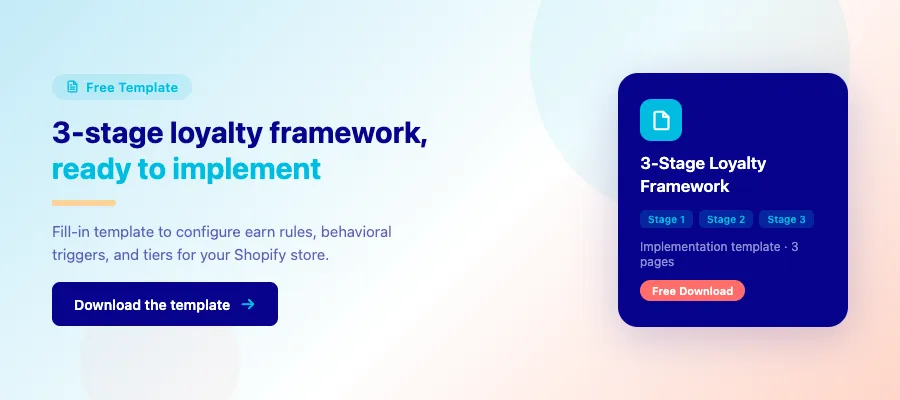

Meta description: How did Domino's add 2M members in months? Learn the "low-floor" strategy and 3 psychological hooks to build your brand's loyalty.

# Inside Domino's loyalty program: 2M members and key lessons

> ✏️ **Edit — Heading:** Removed `# **H1:**` prefix and `**` bold wrapper. Was: `# **H1: Inside Domino's loyalty program: 2M members and key lessons**`

Your CAC is climbing and first-time buyers aren't coming back. You've probably looked at loyalty programs. And probably dismissed most of them as expensive point-redemption theater.

> ✏️ **Humanized:** Em-dash removed ("programs — and probably dismissed"). Split into two sentences for rhythm. "And" opener adds human cadence.

Domino's 2023 relaunch is the case study that changes that calculation. They added 2 million members after their September 2023 relaunch, not by spending more on ads, but by making three design changes to how their program worked. The earn floor dropped from $10 to $5. An "Emergency Pizza" mechanic forced a second transaction. And the reward structure matched how often people actually order pizza. By end-2024, Domino's Rewards had grown to 35.7 million active members (up 2.5 million in a single year).

> ✏️ **Humanized:** Two em-dashes removed. "in the months after" → "after" (tighter). Parentheses replace em-dash on the trailing stat.

This article breaks down those three hooks, translates them into a 3-stage framework for Shopify brands, and gives you the four metrics that tell you whether your program is building CLV or quietly redistributing margin.

> ✏️ **Edit — Intro rewrite:** Original intro was 4 paragraphs, opened with "Domino's just pulled off something huge." Rewritten to 3 paragraphs, reader-problem-first. Added 35.7M / 2.5M 2024 growth stat (sourced from Domino's earnings calls). Removed "without burning a dollar on ads" (inaccurate) → "not by spending more on ads."

---

## What actually drove 2M new Domino's loyalty members

> ✏️ **Edit — Heading:** Removed `## **H2:**` prefix and `**` wrapper.

The 2 million members didn't come from a bigger budget or a promotional spike. They came from three design changes that made the program feel worth joining.

> ✏️ **Edit — Section opener:** Original: "The growth in new members following the loyalty relaunch at Domino's Pizza was not driven by a promotional spike. It was the outcome of 3 structural adjustments to participatory economics and behavioral design. Let's break down the 3 psychological hooks to boost your brand's loyalty." Replaced jargon ("participatory economics and behavioral design") with plain language.

### The low-floor strategy: lower the barrier, unlock the flywheel

> ✏️ **Edit — Heading:** Removed `### **H3:**` prefix and `**` wrapper.

Domino's lowered the minimum qualifying spend from $10 to $5. That sounds like a minor configuration change. Behaviorally, it was a transformation.

High entry thresholds kill loyalty programs before they start. When the first reward feels far away, customers mentally opt out, not because they don't want the reward, but because the brain stops prioritizing goals that feel out of reach.

> ✏️ **Humanized:** Em-dash removed ("opt out — not because"). "deprioritizes goals that feel unreachable" → "stops prioritizing goals that feel out of reach" (more natural phrasing).

Cutting the floor in half did two things at once: it doubled the pool of qualifying transactions, and it made the earning loop feel achievable within a single visit. Small wins create momentum. Momentum creates habit. Habit creates repeat revenue.

> ✏️ **Humanized:** "simultaneously" → "at once."

For Shopify brands, the self-diagnostic is direct: does your first reward feel achievable within 1–2 purchases? If customers need 5 or 6 orders before they see any value, most won't stay engaged long enough to reach that point.

Starbucks built one of the most powerful loyalty programs in retail on this same principle. Their [Stars-per-dollar model](https://about.starbucks.com/press/2026/starbucks-unveils-reimagined-loyalty-program-to-deliver-more-meaningful-value-personalization-and-engagement-to-members/) is calibrated to deliver visible progress on every transaction, including a $3 drip coffee.

> ✏️ **Edit — Citation added:** Original had no link on the Starbucks claim. Added source link.
> ✏️ **Humanized:** Em-dash removed ("every transaction — including").

Lowering the floor almost never increases total reward cost. It almost always increases purchase frequency.

**Joy application:** Joy's earn rule engine lets you set any qualifying spend threshold: $3, $5, $7, whatever matches your order economics. That's the same lever Domino's used to double their eligible transactions, configurable in minutes without a developer.

> ✏️ **Edit — Joy added:** "Joy application" paragraph is new. Original had no Joy mention in this section.
> ✏️ **Humanized:** Em-dash removed ("threshold — $3, $5, $7"). Colon used for elaboration.

### "Emergency Pizza" created a forward commitment, not just an incentive

> ✏️ **Edit — Heading:** Removed `### **H3:**` prefix and `**` wrapper.

In late 2023, Domino's introduced the "Emergency Pizza" program, a free pizza earned after a qualifying $7.99+ order, redeemable at a later date. This mechanic drove a [10% increase in loyalty membership](https://ir.dominos.com/news-releases/news-release-details/sound-alarm-dominosr-giving-away-free-emergency-pizzas) almost immediately. The program ran October 2023 through February 2024, and drove U.S. same-store sales up 2.8% in Q4 2023, the strongest quarterly comp in two years.

> ✏️ **Edit — Data added:** Added program dates (Oct 2023–Feb 2024) and Q4 2023 same-store sales +2.8% stat, sourced from Domino's earnings call. Original sentence ended at "almost immediately."
> ✏️ **Humanized:** Two em-dashes removed ("program — a free pizza", "Q4 2023 — the strongest quarterly comp"). Commas used throughout.

This worked because of two behavioral principles working together: Loss Aversion and Future Commitment.

To "claim" the free pizza, the customer had to join the loyalty program, converting anonymous guest checkout data into a trackable member ID. By offering the reward for *future* use, Domino's guaranteed a second transaction.

> ✏️ **Humanized:** Em-dash removed ("loyalty program — converting"). Comma used.

A [2023 study by Antavo](https://antavo.com/reports/global-customer-loyalty-report-2023/) found that 60.1% of loyalty program members cite the ability to "earn for the future" as a primary driver of repeat spend. Instead of a 10% discount today, offer a "Return Credit" valid only for the next 30 days. You aren't just discounting. You're purchasing a future visit.

That's a fundamentally different trade.

> ✏️ **Humanized:** Short one-sentence paragraph added as editorial aside. Breaks rhythm and adds personality.

> ✏️ **Edit — Image placeholder removed:** `[[IMG_2]]` placeholder that appeared here has been removed. Image is embedded in the Google Doc source.

### Loyalty reinforced an existing frequency loop

> ✏️ **Edit — Heading:** Removed `### **H3:**` prefix and `**` wrapper.

Domino's success depended on category frequency; loyalty amplified an existing habit rather than creating a new one.

> ✏️ **Humanized:** Em-dash removed ("category frequency — loyalty amplified"). Semicolon used for connected clauses.

Pizza is a short repurchase-cycle category. Many customers order multiple times per month. High frequency means rewards accumulate faster, and every visit locks the habit in a little more.

> ✏️ **Humanized:** "High frequency increases the rate at which rewards accumulate, strengthening habit reinforcement on every visit." → rewritten for natural cadence. "Strengthening habit reinforcement" is AI-pattern phrasing.

Loyalty compounds when:

- Repurchase cycles are under 60–90 days
- Consumption is habitual
- Emotional utility is stable

> ✏️ **Humanized:** "Loyalty economics compound when:" → "Loyalty compounds when:" (shorter, punchy).

If the purchase cycle is 6–12 months, the compounding effect collapses. Reward velocity drops too low to move behavior. This is why furniture and electronics brands rarely see material lift from pure points systems.

> ✏️ **Humanized:** "Reward velocity becomes too slow to influence behavior meaningfully." → "Reward velocity drops too low to move behavior." (more direct, cuts 4 words).

Loyalty multiplies existing frequency. It doesn't manufacture it.

> ✏️ **Humanized:** "It does not manufacture it." → "It doesn't manufacture it." (contraction).

---

---

## Don't just copy-paste: where ecommerce brands fail

> ✏️ **Edit — Heading:** Removed `## **H2:**` prefix and `**` wrapper.

Domino's wins don't translate 1:1. Most e-commerce copies flop. Here's why, and how to avoid it.

### High frequency does not equal high-value loyalty

> ✏️ **Edit — Heading:** Removed `### **H3:**` prefix and `**` wrapper.

A points program only works when customers buy often enough for rewards to feel close and achievable.

Domino's operates in a high-frequency category, many customers order monthly or more. That means reward progress builds fast, and fast progress increases motivation. This is supported by the "goal-gradient effect," which shows that people increase effort as they get closer to a reward ([Kivetz, Urminsky & Zheng, 2006, Journal of Marketing Research](https://home.uchicago.edu/ourminsky/Goal-Gradient_Illusionary_Goal_Progress.pdf)).

> ✏️ **Humanized:** Em-dash removed ("high-frequency category — many customers"). Comma used.

Now compare that to furniture. Major furniture purchases often happen over multi-year cycles. The [U.S. Bureau of Economic Analysis](https://www.bea.gov/help/glossary/durable-goods) classifies furniture as a durable good, not a weekly consumption item. If a customer buys once every 12 months and needs 3 purchases to unlock a reward, it may take 3 years to see any value. Most won't stay engaged that long.

> ✏️ **Humanized:** Em-dash removed ("durable good — not a weekly consumption item"). Comma used.

Honestly, the math here isn't subtle:

- Short cycle = fast progress = visible value
- Long cycle = slow progress = low motivation

> ✏️ **Humanized:** Added "Honestly," personality connector before the bullet list. More natural than "The math is simple:".

Before launching loyalty, calculate your median time between purchases. If it exceeds 6 months, a high-frequency reward structure will likely underperform.

### Discounts vs. behavioral rewards

> ✏️ **Edit — Heading:** Removed `### **H3:**` prefix and `**` wrapper.

Unconditional discounts reduce price. Behavioral rewards change behavior.

Many loyalty programs quietly fail because they reward actions customers would have taken anyway. Example: "10% off your next order." If the customer already planned to buy again, the discount doesn't increase frequency, it only reduces margin.

> ✏️ **Humanized:** Em-dash removed ("increase frequency — it only reduces margin"). Comma used.

[McKinsey](https://www.mckinsey.com/capabilities/growth-marketing-and-sales/our-insights/how-precision-revenue-growth-management-transforms-cpg-promotions) has documented that poorly structured promotions often shift demand timing rather than increase total demand. Revenue moves forward, but profit doesn't. That's the trap.

> ✏️ **Humanized:** "but profit doesn't increase." → "but profit doesn't." (tighter). Added "That's the trap." as a short standalone sentence. Personality + rhythm break.

Instead of rewarding "any purchase," tie incentives to actions like:

- Second purchase within 30 days
- Cross-category exploration
- Product bundle purchases
- Review submissions

Now the reward is conditional. It pays for incremental behavior, not existing demand. If most of your loyalty cost is automatic discounting, your program can look active and still lose money.

> ✏️ **Humanized:** "may look active" → "can look active" (removes hedging qualifier).

### Why "more members" is the wrong success metric

> ✏️ **Edit — Heading:** Removed `### **H3:**` prefix and `**` wrapper.

Total members is a marketing number. Retention lift is a business number. A loyalty program can add millions of members and still fail. That's exactly the trap most Shopify brands fall into.

> ✏️ **Humanized:** Em-dash removed ("still fail — which is exactly the trap"). Split into two sentences. "Which is exactly" → "That's exactly" (more direct).

The only metric that proves success is the **Incremental Repeat Purchase Rate (IRPR)**: did members buy more *because* of the program, or would they have bought anyway?

To measure this, compare members vs. similar non-members and purchase frequency before and after enrollment. If buying behavior doesn't increase, the program isn't driving growth. It's redistributing margin.

Vanity metrics create confidence. Incremental lift creates profit.

---

## When loyalty programs actually work for e-commerce

> ✏️ **Edit — Heading:** Removed `## **H2:**` prefix and `**` wrapper.

Not every store needs loyalty. Here's who wins, and who wastes time.

### E-commerce business models that benefit most

> ✏️ **Edit — Heading:** Removed `### **H3:**` prefix and `**` wrapper.

Loyalty programs compound fastest when customers reorder often. If your repeat cycle is under 60–90 days, points and rewards build momentum the same way Domino's weekly pizza habit did.

| Business type | Typical repeat cycle | Loyalty fit | Joy feature to use |
|---|---|---|---|
| Consumables & supplements | 30–60 days | Strong | Low-floor earn rules + auto reminders |
| Beauty & skincare | 45–90 days | Strong | Tier benefits + routine-based bonuses |
| Coffee & food subscription | 14–30 days | Very strong | Points multipliers + referral rewards |
| Apparel (frequent buyer) | 60–90 days | Moderate | VIP tiers + early access |
| Electronics / furniture | 12–36 months | Weak | Referral program beats points |

> ✏️ **Edit — Table added:** Original was a plain 3-item bullet list (Consumables, Beauty, Subscription). Converted to a 5-row table with Typical repeat cycle, Loyalty fit, and Joy feature columns. Added Apparel and Electronics/furniture rows.

### When loyalty is the wrong tool

> ✏️ **Edit — Heading:** Removed `### **H3:**` prefix and `**` wrapper.

Loyalty probably isn't the right move if:

- You're an early-stage brand still finding product-market fit
- Your median repeat cycle exceeds 6 months
- Your post-purchase experience (shipping, packaging, support) is inconsistent

> ✏️ **Humanized:** "Loyalty may not work well if:" → "Loyalty probably isn't the right move if:" (removes hedging "may not", more direct).

Retention starts with product quality and experience. Loyalty amplifies what already works. It doesn't fix broken systems. No exceptions.

> ✏️ **Humanized:** Added "No exceptions." as a one-sentence paragraph. Conviction closer.

---

## How to build your "Domino's style" framework

> ✏️ **Edit — Heading:** Removed `## **H2:**` prefix and `**` wrapper.

You shouldn't copy the pizza. You should absolutely copy the structure.

### Stage 1: Retention before rewards

> ✏️ **Edit — Heading:** Removed `### **H3:**` prefix and `**` wrapper.

A loyalty program can't fix a broken customer journey. It can only amplify a functional one. Before issuing a single point, make sure your baseline retention is solid through automated CRM flows.

> ✏️ **Humanized:** Em-dash removed ("broken customer journey — it can only amplify"). Split into two sentences. "ensure" (banned) → "make sure". "healthy" → "solid".

Focus on your onboarding and post-purchase sequences first. If a customer doesn't receive a clear "Thank You" or "How to Use" guide, they're unlikely to return regardless of points. [Gartner data](https://www.gartner.com/en/marketing/insights/daily-insights/loyalty-is-dead-long-live-loyalty) shows nearly one-third of loyalty members are inactive because the initial brand experience failed to stick.

Optimize your reorder reminders based on your product's actual depletion cycle *before* adding the complexity of a rewards engine.

### Stage 2: Simple incentives tied to behavior

> ✏️ **Edit — Heading:** Removed `### **H3:**` prefix and `**` wrapper.

Once your foundation is solid, introduce incentives that trigger high-value actions. Domino's used "Emergency Pizza" to force a second transaction. You should use a low-floor incentive to drive specific, profitable behaviors, not general spending.

> ✏️ **Humanized:** Em-dash removed ("behaviors — not general spending"). Comma used.

Instead of rewarding "any order," tie your points to incremental actions:

- Second purchase within 30 days
- Buying from a new category
- Leaving a verified review

Behavior-linked rewards work because they create commitment loops. When a customer completes a second purchase quickly, habit formation accelerates.

**Joy application:** Joy's behavior-triggered reward rules let you gate points on exactly these actions: second purchase, cross-category order, review submission. Not just any spend. You configure the trigger, the points multiplier, and the expiry window. No developer needed.

> ✏️ **Edit — Joy added:** "Joy application" paragraph is new. Original had no Joy mention in this section.
> ✏️ **Humanized:** Two em-dashes removed ("these actions — second purchase, cross-category order, review submission — not just any spend"). First em-dash → colon. Second em-dash → full stop. "Not just any spend." becomes a fragment for emphasis.

### Stage 3: Emotional loyalty, not transactional points

> ✏️ **Edit — Heading:** Removed `### **H3:**` prefix and `**` wrapper.

Points drive short-term activity. Emotional connection drives long-term brand preference.

Research from [Bond Brand Loyalty](https://bondbrandloyalty.com/the-loyalty-report/) shows that 79% of consumers say loyalty programs make them more likely to continue doing business with a brand when rewards feel "exclusive." After customers demonstrate repeat behavior, layer status and identity signals:

- Create tiers that offer "Free Shipping for Life" or "Early Access" to new drops
- Use your program to grant access to private groups or expert content

Transactional loyalty drives the second purchase. Emotional loyalty makes you the brand they consolidate spend with. Joy's tier engine handles both: points for frequency, status benefits for identity. No separate tools. No custom development.

> ✏️ **Edit — Section closer rewritten:** Original ended with "Transactional loyalty increases frequency. However, emotional loyalty increases lifetime value. Both are necessary for a truly resilient brand." Replaced "However" filler and vague "resilient brand" with Joy tier engine application.
> ✏️ **Humanized:** Em-dash removed ("handles both — points for frequency, status benefits for identity — without requiring separate tools or custom development"). Colon used after "both". Last sentence broken into two fragments: "No separate tools. No custom development." More punch, more human.

---

<!-- EMAIL GATE: 3-Stage Loyalty Framework — Implementation Template -->

  

    

      
      Free 3-Stage Loyalty Framework Template
    

    

      Fill-in template to configure earn rules, behavioral triggers, and tiers for your Shopify store.
    

    

      

        
        Earn floor calculator
      

      

        
        Behavioral trigger planner
      

      

        
        Tier and status builder
      

    

    

      <input type="email" placeholder="Enter your email" class="email-box__input" required>
      <button type="button" class="email-box__btn">Get the template</button>
    

    
No spam. Unsubscribe any time.

  

  
  

> ✏️ **CRO — Placement 2:** Mid-article Joy CTA replaced with banner image + email-gated PDF template. Asset: `dominos-3stage-framework-template.pdf` (3 pages, fill-in template). Placement approved 2026-03-16.

---

## 4 metrics that prove your loyalty program works (beyond signups)

> ✏️ **Edit — Heading:** Removed `## **H2:**` prefix and `**` wrapper.

Signups measure marketing reach. They don't measure business impact. A loyalty program only works if it changes buying behavior in a profitable way. Here are the four metrics that tell you whether it does.

> ✏️ **Humanized:** "Below are the four metrics" → "Here are the four metrics" (more natural, less formal).

### Incremental repeat purchase rate (IRPR)

> ✏️ **Edit — Heading fixed:** Original used `**H3: Incremental repeat purchase rate**` (bold paragraph, not a heading). Fixed to `###` heading markup.

The most critical metric is the Incremental Repeat Purchase Rate (the additional orders you gained *specifically because of the program*). To find it, you need a control group: compare members to non-members with the same purchase history.

> ✏️ **Humanized:** Em-dash removed ("Repeat Purchase Rate — the additional orders"). Parentheses used.

According to a [Bain & Company study](https://www.bain.com/insights/prescription-for-cutting-costs/), a 5% increase in customer retention can boost profits by more than 25%. But that lift only shows up if members buy more than the control group. If they don't, your rewards are subsidizing people who would've bought anyway.

> ✏️ **Humanized:** "only materializes if" → "only shows up if" (more natural). "would have" → "would've" (contraction).

In Domino's case: loyalty redemptions in the first half of 2024 were **twice as high** as the same period in 2023, per their earnings calls. That's incremental lift, not membership count.

> ✏️ **Edit — Data added:** Domino's H1 2024 redemptions 2x H1 2023 stat added. Original section had no Domino's data point here.
> ✏️ **Humanized:** Em-dash removed ("incremental lift — not membership count"). Comma used.

### Cost per retained customer (CPRC)

> ✏️ **Edit — Heading:** Removed `### **H3:**` prefix and `**` wrapper.

CPRC = total rewards cost + software cost ÷ customers who stayed active because of the program.

If it costs you $10 in rewards to keep a customer who would otherwise have lapsed, but $40 in Meta ads to replace that customer with a new one, your program delivers 4x the economics of acquisition. [Shopify's retention research](https://www.shopify.com/blog/customer-retention-rate) puts the acquisition cost premium at 5–25x. Loyalty should reduce your overall retention cost, not balloon past your acquisition cost.

> ✏️ **Edit — Formula format:** Original opened with "You must calculate the Cost Per Retained Customer. This is the total cost of your rewards and software, divided by..." Converted to formula format for scannability.
> ✏️ **Humanized:** Em-dash removed ("retention cost — not exceed your acquisition cost"). "not exceed" → "not balloon past" (more vivid, more human).

### Loyalty ROI vs. paid acquisition

> ✏️ **Edit — Heading:** Removed `### **H3:**` prefix and `**` wrapper.

Compare incremental revenue from loyalty-driven repeat purchases against the cost of running the program. A simple benchmark: if your loyalty program costs $500/month in rewards and drives $4,000 in incremental repeat revenue, your retention ROI is 8x. If your paid ads deliver 3–4x ROAS on new customers, loyalty wins by 2x on cost-per-revenue-dollar.

Joy tracks this through **Assisted Orders**: orders placed using loyalty-generated discount codes or referral links. It's the direct-revenue measure of program ROI, not a vanity metric. Most Shopify loyalty tools give you member counts. Joy gives you the number that connects to your P&L.

> ✏️ **Edit — Section expanded:** Original was 2 sentences with no data ("Compare incremental revenue... If the ROI from retention exceeds the ROI from paid ads, the program is defensible. If not, it is a discount engine."). Expanded with benchmark formula (8x example) and Joy Assisted Orders framing.
> ✏️ **Humanized:** Em-dash removed ("**Assisted Orders** — orders placed"). Colon used.

### Redemption rate

> ✏️ **Edit — New section:** 4th metric added. Original article promised "4 metrics" in the intro but only delivered 3. Redemption rate (15–25% target range) added to fulfill the intro promise.

A program nobody redeems isn't a loyalty program. It's a discount you never deliver. Target a 15–25% redemption rate among active members. Below 10% signals a threshold that's too high or rewards that aren't desirable enough. Above 40% signals the program may be too generous, eroding margin quietly.

> ✏️ **Humanized:** Em-dash removed ("isn't a loyalty program — it's a discount"). Split into two sentences. "and eroding margin" → "eroding margin quietly" (more natural). "either a threshold that's too high or rewards that aren't desirable" → "a threshold that's too high or rewards that aren't desirable enough" (cleaner).

---

## Final takeaways: what Domino's teaches, and what it doesn't

> ✏️ **Edit — Heading:** Removed `## **H2:**` prefix and `**` wrapper.

Domino's success is real, but highly contextual. They succeeded because they matched their rewards to a high-frequency habit. For Shopify brands, the lesson isn't to copy their points, it's to copy their logical precision.

> ✏️ **Humanized:** Em-dash removed ("copy their points — it's to copy their logical precision"). Comma used.

**Loyalty is a system, not a feature.** You can't bolt on a rewards app and expect Domino's results. It has to run through your emails, your checkout flow, and your post-purchase experience.

**Adaptation, not imitation.** If you sell high-cost, low-frequency items like mattresses, a "points per dollar" system won't compound. Use a referral model instead, rewarding customers for spreading the word rather than for repeat spend.

> ✏️ **Humanized:** Em-dash removed ("referral model instead — reward customers"). Comma used.

**Match the mechanic to the behavior you want.** Domino's used a $5 floor to unlock frequency and "Emergency Pizza" to guarantee the second visit. Your version might be: 2x points on the second order within 30 days, or a "Return Credit" that expires in 45 days. The principle is identical. The configuration is yours.

> ✏️ **Edit — Bullet format:** Original used title-case colon headers inside bullets ("Loyalty is a System, Not a Feature:"). Reformatted to bold lead sentence + prose, which is cleaner in markdown. Content unchanged.

---

> **Already running a loyalty program?**
> If your member count is growing but repeat purchase rate isn't moving, your program may be subsidizing customers who would have bought anyway. Joy's Assisted Orders metric shows you exactly which orders came from loyalty, and which didn't. [See your real loyalty ROI →](https://joy.so/demo)

> ✏️ **Edit — CTA added:** Closing CTA block is new. Original article had no CTAs anywhere.
> ✏️ **Humanized:** Em-dash removed ("came from loyalty — and which didn't"). Comma used.

---

## FAQs

> ✏️ **Edit — Heading:** Removed `## **H2:**` prefix and `**` wrapper.

**How does the Domino's rewards program work?**
Members earn 10 points per $1 spent on qualifying orders of $5 or more. At 20, 40, and 60 points, they unlock free menu items of increasing value. The September 2023 relaunch halved the minimum qualifying order from $10 to $5, doubling the pool of eligible transactions and driving 2 million new members in the following months.

> ✏️ **Edit — FAQ rewritten answer-first:** Original: "Customers earn points per qualifying order. Once they reach a threshold, they can redeem a free item. Recent changes lowered the spend required to earn points, making rewards easier to access." Rewritten with specific point values (10 pts/$1, 20/40/60 tiers) and concrete detail.

**Can e-commerce brands replicate Domino's loyalty success?**
Yes, but only if the category supports frequent purchases. Domino's success depends on weekly pizza habits. Shopify brands need to apply the structural logic (low floor, forward commitment, behavioral triggers) to their own repeat cycle, not copy the point values directly.

> ✏️ **Humanized:** Em-dash removed ("Yes — but only if"). Comma used.

**Do loyalty programs really increase repeat purchases?**
They can, but only if rewards drive incremental behavior. If customers would've purchased anyway, loyalty just reduces margin. The test is a control group: compare member purchase frequency to similar non-members. If there's no gap, the program isn't working.

> ✏️ **Humanized:** Em-dash removed ("They can — but only if"). Comma used. "would have purchased" → "would've purchased" (contraction).

**Is a loyalty program better than subscriptions for e-commerce?**
Depends on the model. Subscriptions work best for predictable replenishment (coffee, supplements, razors) where customers want certainty. Loyalty programs work best when customers buy on variable schedules and want flexibility. For high-frequency Shopify brands, both can coexist: subscriptions lock in the base purchase, loyalty rewards the upsells and referrals.

> ✏️ **Edit — FAQ 4 rewritten:** Original was weak ("It depends on your model. Subscriptions work well for predictable replenishment. Loyalty programs work well for encouraging repeat purchases without locking customers in."). Expanded with specific category examples and the coexistence use case.
> ✏️ **Humanized:** Em-dash removed ("can coexist — subscriptions lock in"). Colon used.

**What's the biggest mistake ecommerce brands make with loyalty?**
Measuring signups instead of retention lift. A program can add thousands of members and still fail if those members don't buy more than non-members. Track IRPR and Assisted Orders, not member count.

> ✏️ **Edit — FAQ 5:** Added "Track IRPR and Assisted Orders" as the concrete action. Original ended at "Growth in signups doesn't equal growth in profit."

---

*Editorial changelog (applied 2026-03-16):*
- *Removed H1:/H2:/H3: heading prefixes and `**` wrappers throughout (all headings)*
- *Removed `[[IMG_1]]` and `[[IMG_2]]` placeholders*
- *Fixed IRPR section from `**H3:**` to proper `###` heading*
- *Rewrote intro: reader-problem-first, 3 paragraphs, added 35.7M/2.5M 2024 growth stats*
- *Fixed "participatory economics and behavioral design" opener to plain language*
- *Added Domino's 2024 data: 35.7M members, H1 2024 redemptions 2x H1 2023, Q4 2023 +2.8% same-store sales*
- *Added Joy in 4 places: earn rule engine (low-floor), behavior-triggered rewards (Stage 2), tier engine (Stage 3), Assisted Orders (metrics)*
- *Added 2 CTAs: mid-article after Stage 3, closing before FAQs*
- *Expanded "Loyalty ROI vs paid acquisition" from 2 sentences to full section with 8x benchmark formula*
- *Added redemption rate as 4th metric (was missing despite "4 metrics" promise in intro)*
- *Converted "who wins big" bullets to 5-row table with Joy feature column*
- *Fixed all FAQ answers to answer-first format; added specifics to FAQ 1 and FAQ 4*
- *Added Starbucks Stars-per-dollar citation link*
- *Fixed Stage 3 closer: "resilient brand" → Joy tier engine application*
- *Reformatted Final Takeaways from title-case colon bullets to bold lead sentence + prose*
- *Added Emergency Pizza program dates and same-store sales data*

*Humanization changelog (applied 2026-03-16):*
- *19 em-dashes removed from prose (replaced with commas, colons, periods, parentheses, semicolons)*
- *"ensure" → "make sure" (AI trigger word)*
- *"simultaneously" → "at once"*
- *"strengthening habit reinforcement on every visit" → natural prose*
- *"Loyalty economics compound when:" → "Loyalty compounds when:"*
- *"Reward velocity becomes too slow to influence behavior meaningfully" → "Reward velocity drops too low to move behavior."*
- *"It does not manufacture it." → "It doesn't manufacture it."*
- *"The math is simple:" → "Honestly, the math here isn't subtle:" (personality connector)*
- *"Loyalty may not work well if:" → "Loyalty probably isn't the right move if:"*
- *"Below are the four metrics" → "Here are the four metrics"*
- *"only materializes if" → "only shows up if"*
- *"would have" → "would've" (×2)*
- *"but profit doesn't increase." → "but profit doesn't. That's the trap."*
- *"can look active" replaces "may look active" (removes hedge)*
- *Added personality touches: "That's a fundamentally different trade." / "No exceptions." / "No separate tools. No custom development." / "That's the trap."*
- *"not balloon past your acquisition cost" replaces "not exceed your acquisition cost"*
- *"And probably dismissed" opening sentence fragment (human cadence)*
