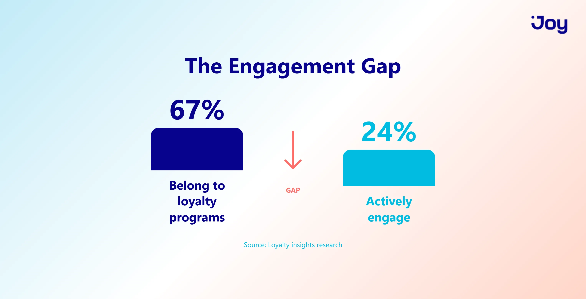
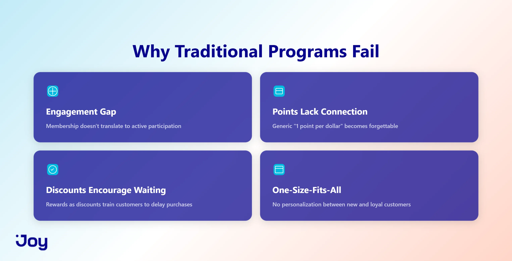
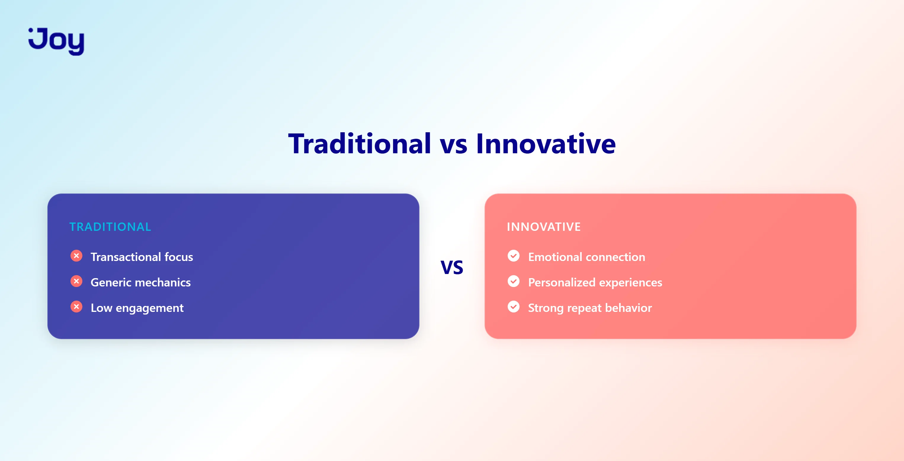
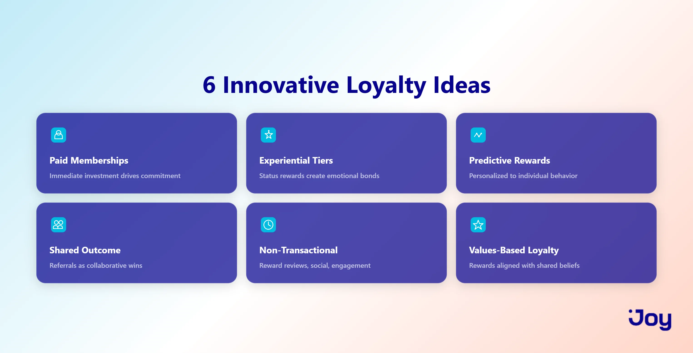

# 6 Innovative Loyalty Programs That Drive Repeat Purchases

## Overview

The article explores why traditional loyalty programs are failing and presents six innovative approaches that create genuine customer engagement and repeat purchases.

## Key Statistic

"67% of consumers belong to at least three loyalty programs, but only 24% actively engage with them."

---

## I. Why Traditional Loyalty Programs Are Losing Steam

Traditional loyalty programs follow a simple formula: spend money, earn points, redeem for discounts. However, this model is showing significant cracks:

### Problems with the Current Model

1. **Engagement Gap**: Over 78% of program owners plan major revamps within three years because the old approach treats loyalty as a transaction rather than a relationship.

2. **Points Lack Connection**: When every retailer offers "1 point per dollar," programs become forgettable. Only 44% of members report satisfaction with their programs.

3. **Discounts Encourage Waiting**: Offering rewards as discounts trains customers to hold off purchases rather than building lasting preference.

4. **One-Size-Fits-All Approach**: Programs treat first-time buyers and five-year customers identically, without personalization or recognition of loyalty depth.

---

## II. What Makes a Program "Innovative"?

An innovative loyalty program distinguishes itself by:

- Rewarding behaviors beyond purchases
- Creating emotional connections, not just transactions
- Providing reasons to choose your brand over competitors with similar discounts
- Fitting naturally into existing customer shopping patterns

---

## III. Six Innovative Ideas to Reset Loyalty Programs

### Idea 1: Paid Memberships

Rather than free enrollment, paid memberships create immediate customer investment.

**Why It Works**: Customers who pay for membership are committed from day one, leading to increased shopping frequency and higher spending.

**Real Examples**:
- REI's Co-op: $30 lifetime membership with 23 million members receiving 10% annual rewards plus exclusive events
- HuHot Restaurant: $9.99 monthly BOGO subscription resulted in members visiting three times more often and spending six times more than non-members

**Success Factors**:
- Immediate tangible value (free shipping, exclusive discounts)
- Benefits justifying the cost within one or two purchases
- A sense of belonging to something exclusive

**Best For**: Brands with repeat-purchase products, strong brand affinity, and consistent benefit delivery.

---

### Idea 2: Experiential Tiers

Instead of rewarding spending with discounts, offer status-based experiences that money cannot buy.

**Why It Works Better Than Discounts**: Discounts encourage waiting for sales; experiences create shareable stories. Experiential rewards cost 40-60% less than discounts while driving stronger emotional connections.

**Real Examples**:
- Sephora Rouge: First access to new launches, exclusive events, and early annual sale entry
- REI: Access to classes, gear rentals, and adventure trips unavailable to non-members
- Streetwear brands: Product co-creation sessions, design voting, and private shopping events

**Top Tier Benefits Should Include**:
- Early launch and restock access
- Exclusive member-only products
- Behind-the-scenes content and founder access
- Input on future collections
- Virtual or in-person event invitations

---

### Idea 3: Predictive Rewards

Personalize reward offerings based on individual customer behavior and purchase history rather than presenting a generic catalog.

**Why It Works**: Customers feel understood rather than marketed to. A protein powder customer doesn't need vitamin discounts—they want points toward their next preferred purchase.

**Real Examples**:
- Starbucks Rewards: Customized bonus challenges based on individual order patterns, with 35.5 million active members driving 59% of company sales
- Birchbox: Members set preferences; rewards reflect individual tastes

**Implementation Keys**:
- Match rewards to purchase history
- Time rewards around typical reorder windows
- Offer three curated options rather than twenty generic ones
- Leverage existing Shopify data on purchase frequency, categories, and order value

---

### Idea 4: Shared Outcome Referrals

Structure referrals around collective benefits rather than individual rewards.

**Why It Feels Different**: Language matters. "We both get $20 when you order" feels collaborative; "I get paid if you buy" feels transactional.

**Enhancement Strategy**: Tie referrals to community outcomes—"Every 50 referrals funds $500 toward ocean cleanup" or "100 referrals unlock early collection access for all members."

**Real Examples**:
- Girlfriend Collective: Equal rewards for both parties aligned with environmental values
- Headspace: Free membership donations for each new subscription referral

**Success Factors**:
- Equal rewards for referrer and friend
- Language emphasizing "we" and "together"
- Collective goals reflecting brand values
- Visible progress toward community milestones

---

### Idea 5: Non-Transactional Engagement Rewards

Recognize and reward customer interactions beyond purchases.

**Why It Works**: Customers who engage more tend to buy more. Rewarding non-purchase actions creates habit loops that increase brand proximity.

**Real Examples**:
- e.l.f. Cosmetics Beauty Squad: Points for social follows, reviews, and website browsing
- OSEA Malibu: Reviews, referrals, and social engagement rewards; 77% repeat purchase rate for redeemers with 40% higher average order value

**Actions Worth Rewarding**:
- Product reviews
- Social media follows
- Newsletter or SMS signups
- Profile completion or quizzes
- Social product sharing
- Birthday or anniversary engagement

**Balance Principle**: Non-transactional points should complement, not replace, purchase rewards (50 points for reviews vs. 500 points for purchases).

---

### Idea 6: Values-Based Loyalty

Build program mechanics around shared customer values and beliefs.

**Why It Works**: 31% of consumers want sustainability-focused rewards; this percentage rises among Gen Z and Millennials. Values-based loyalty signals brand alignment.

**Real Examples**:
- Patagonia Worn Wear: Store credit for trading in used gear, reinforcing environmental identity
- H&M: Points for recycling old clothing with 200+ million member participation
- Starbucks: Bonus stars for bringing reusable cups

**Critical Requirements**:
- Rewards tied to authentic actions reflecting shared values
- Visible collective impact displays
- Genuine brand alignment (not marketing pretense)

---

## IV. How to Choose the Right Approach

Selection depends on three questions:

**1. Customer Purchase Frequency**
- High frequency (monthly+): Predictive rewards and non-transactional engagement maintain connection between purchases
- Low frequency (few times yearly): Experiential tiers and identity-based programs provide engagement reasons

**2. Brand Relationship Strength**
- Building trust: Begin with shared referrals and non-transactional rewards requiring minimal customer commitment
- Established loyal base: Consider paid memberships or experiential tiers for invested audiences

**3. Brand Values**
- Clear values (sustainability, community, craftsmanship): Build identity-based loyalty reflecting those principles
- Product-focused (quality, selection, price): Emphasize predictive rewards and experiential perks

---

## Conclusion

Success requires selecting one approach initially, testing for several months while monitoring customer behavior over stated preferences, then building incrementally from that foundation.
