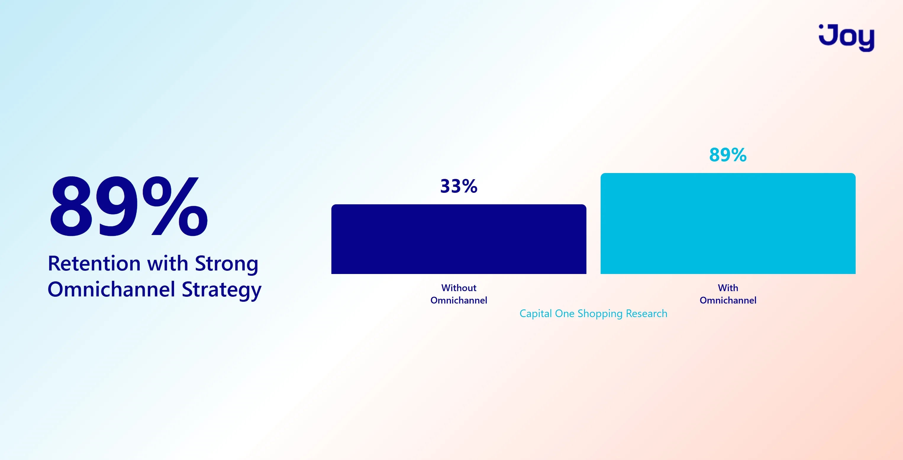
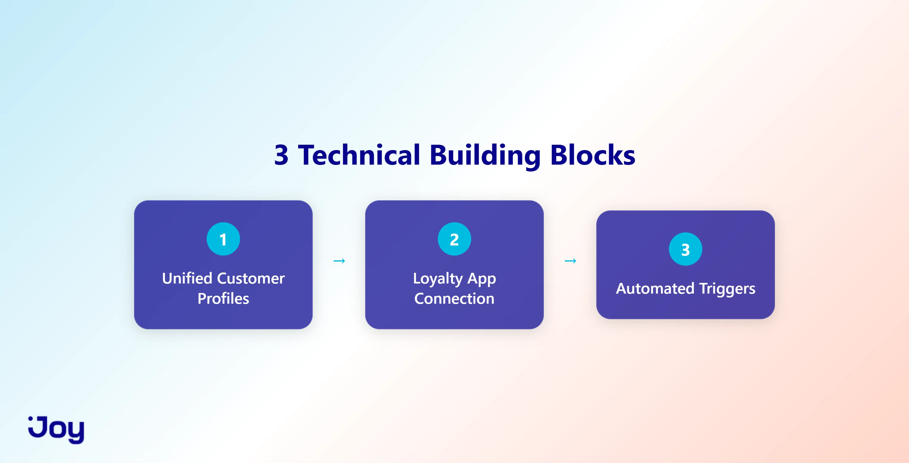
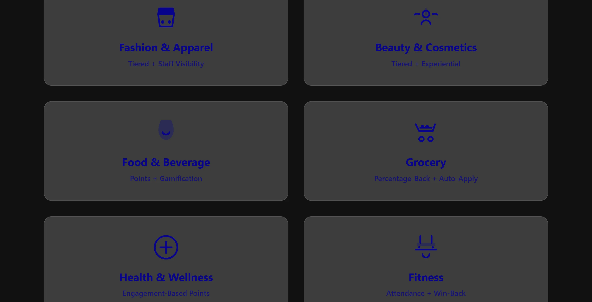
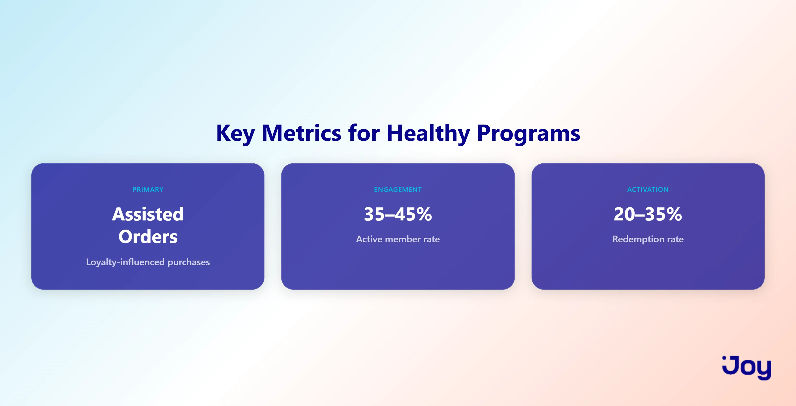

# Omnichannel Loyalty Programs: Best Programs by Industry (2026)

> ✏️ Edit: Removed redundant bold formatting from H1 — headings don't need bold markup.

**Meta title:**  Omnichannel Loyalty Programs: Best Programs by Industry
**Meta description:** See how top brands in beauty, food, fitness, and retail run omnichannel loyalty programs. Real examples with specific program structures you can copy.
**Excerpt:**  Your loyalty program works on your website. Does it work in-store? On mobile? Across every channel your customers use?

> ✏️ Edit: Removed hedging "might" from excerpt — Joy's voice doesn't hedge. Rewritten as direct challenge.

If you're running a loyalty program for your store, you've probably hit this wall before: a customer earns points online, walks into your physical location, and has no idea those points exist. Or the reverse. They're a regular in-store buyer, and your website treats them like a stranger.

That disconnect doesn't just feel broken. It costs you repeat purchases. [73% of retail shoppers](https://marketingltb.com/blog/statistics/omnichannel-statistics/) now interact with brands across more than one channel during a single purchase journey.

But here's what most guides on this topic get wrong: they treat omnichannel loyalty as one universal playbook. It's not. What works for a beauty brand looks nothing like what works for a gym or a grocery store.

So this guide skips the generic advice. Instead, you'll find specific omnichannel loyalty programs broken down by industry, with real brand examples and program mechanics you can actually adapt for your own store.

  
Key Takeaways

  <ul style="margin: 0; padding-left: 20px; color: #1a1a3e; line-height: 1.7;">
    <li style="margin-bottom: 14px;"><strong>One unified customer profile is the whole game.</strong> If your POS and your online store hold separate records, you don't have an omnichannel program. You have two disconnected ones. Companies with strong omnichannel retention keep 89% of customers, compared to 33% for those without it.</li>
    <li style="margin-bottom: 14px;"><strong>The right mechanic depends on your industry.</strong> What drives repeat visits at a gym looks nothing like what works for a beauty brand or a grocery store. This guide breaks down real program structures by vertical so you can adapt the one that fits, not copy a generic playbook.</li>
    <li style="margin-bottom: 0;"><strong>Multi-channel shoppers are already worth more.</strong> Customers who engage across more than one channel shop 1.7 times more frequently than single-channel buyers. Your loyalty program's job is to connect those channels so that advantage compounds over time, not gets lost in data silos.</li>
  </ul>

## I. What Makes a Loyalty Program "Omnichannel" (and Why It Matters)

> ✏️ Edit: Removed bold formatting from H2 — headings use markdown level, not bold markup.

Here's a quick test. Can a customer earn points at your physical register and redeem them on your website without creating a second account?

If not, you're running a multichannel program, not an omnichannel one.

The difference matters more than it sounds. Multichannel means your loyalty program *exists* on multiple channels, but each one operates independently. Separate point balances. Separate customer profiles. Separate data. Your online store knows one version of the customer, and your POS knows another.

Omnichannel loyalty **connects all of that into one system**. One customer profile. One point balance. Every channel talks to every other channel in real time.

Here's a concrete example. A customer signs up for your newsletter and gets a 10% discount. They walk into your store the next day to use it, and the cashier has no record of it. That's multichannel. In an omnichannel setup, the discount appears the moment the cashier pulls up the customer's profile, because the email platform and the POS share the same data.

> ✏️ Edit: Replaced "A quick example:" opener with "Here's a concrete example." — more direct and confident. Trimmed redundant words mid-sentence ("gets promised a 10% discount" → "gets a 10% discount").

Here's how the two compare side by side:

|  | Multichannel | Omnichannel |
| ----- | ----- | ----- |
| Customer profiles | Separate per channel | One unified profile |
| Points and rewards | Channel-specific | Earn anywhere, redeem anywhere |
| Data | Siloed by platform | Synced in real time |
| Customer experience | Inconsistent | Consistent across touchpoints |

**Why does this distinction drive results?**

Companies with strong omnichannel strategies retain [89% of their customers](https://capitaloneshopping.com/research/omnichannel-statistics/), compared to 33% for companies with weak omnichannel engagement. That gap isn't subtle. It's the difference between a loyalty program that builds your business and one that just takes up space in your tech stack.

> ✏️ Edit: Removed orphaned comma after hyperlink text (typographic fix).

Most programs fail at omnichannel not because the idea is complicated, but because **the data stays trapped**. The POS holds purchase history. The email platform holds engagement data. The online store holds browsing behavior. Nobody sees the full picture, and your customer feels that disconnect every time they switch channels.

The fix starts with three technical building blocks.

## II. The 3 Technical Building Blocks Every Omnichannel Program Needs

> ✏️ Edit: Removed bold formatting from H2.

Your loyalty program doesn't need an enterprise tech stack to go omnichannel. But it does need these three things working together. If any one is missing, the experience breaks.

> ✏️ Edit: Tightened opening — rewritten to lead with the claim, not the hedge. Removed "You don't need" framing (starts with negative) → "Your loyalty program doesn't need."

### 1. Unified customer profiles

> ✏️ Edit: Removed numbered list escape characters from H3 headings (1\. → 1.) and bold formatting.

Your POS, online store, and email platform all need to share the same customer record. Not a copy. Not a nightly sync. The *same* record, updated in real time.

> ✏️ Edit: Removed redundant "your" before "email platform" — tightened.

On Shopify, this means a single customer database syncing between your online store and Shopify POS. When a customer checks out at your physical register, their loyalty points update instantly on their online account too. No duplicate profiles. No mismatched balances.

> ✏️ Edit: Removed "using" — noun-heavy construction. "means using a single customer database" → "means a single customer database syncing."

[61% of Shopify merchants](https://www.shopify.com/enterprise/blog/customer-data-integration) reported saving time on reporting and analytics after consolidating their POS and ecommerce data into one system. That's not just a convenience win. Fewer data silos means your marketing team, store associates, and loyalty program all see the same customer.

> ✏️ Edit: Removed "In a 2023 survey" preamble — buried the stat. Led with the stat directly. Also removed redundant "your" before "loyalty program."

### 2. A loyalty app that connects to your sales channels

> ✏️ Edit: Removed bold formatting from H3.

This is where most setups quietly break. A merchant installs a loyalty app for their website, it works great online, then they discover it doesn't talk to their POS at all. Now they're running two disconnected systems, and the customer has no idea why their points didn't show up in-store.

> ✏️ Edit: Changed "A store owner" to "A merchant" — aligns with Joy's ICP language. Tightened sentence construction (removed repetitive "Then they realize").

Your loyalty app needs **native integrations with your POS**, your ecommerce platform, and your email or SMS tools. Before you commit to one, check whether it actually syncs point balances and customer data across every channel you sell on. Not "coming soon." Not through a workaround. Right now.

> ✏️ Edit: Replaced "Before you pick one" with "Before you commit to one" — more decisive. "all the channels" → "every channel."

### 3. Automated triggers across channels

> ✏️ Edit: Removed bold formatting from H3.

Cross-channel triggers are what transform loyalty from a passive tracker into a retention engine. Points earned, rewards unlocked, tier upgrades, expiration reminders: all of it fires automatically, regardless of where the transaction happened.

> ✏️ Edit: Rewrote H3 opener to lead with the claim rather than listing examples first. Moved the claim to sentence 1.

Here's what that looks like in practice. A customer buys in-store and earns 50 points. Two hours later, they get an SMS with their updated balance and a note that they're 20 points from a reward. They didn't have to check an app or log into your website. The system reached them where they are.

> ✏️ Edit: Tightened last sentence in the example. "They didn't have to check an app. They didn't have to log into your website." → collapsed to one sentence.

That kind of cross-channel automation turns your loyalty program from a passive tracker into something that actively brings customers back.

## III. Best Omnichannel Loyalty Programs by Industry

> ✏️ Edit: Removed bold formatting from H2.

The programs below aren't theoretical. They're real examples from brands that connect loyalty across physical stores, online shops, and apps, with the specific program mechanics behind each one so you can adapt the structure for your own store.

> ✏️ Edit: Tightened long prose list ("physical stores, online shops, apps, and more") and removed trailing "and more."

### 3.1 Fashion & Apparel

> ✏️ Edit: Removed bold formatting from H3.

Fashion shoppers split their journey across channels. They browse online, try things on in-store, then buy wherever price or convenience wins. If your loyalty program only tracks one side of that behavior, you're seeing half the customer.

> ✏️ Edit: Tightened opener — "have a split personality" is a cliché. Rewritten to state the specific behavior directly.

**What works: Nordstrom's The Nordy Club**

Members earn points per dollar across every channel (in-store, online, and Nordstrom Rack locations). The program runs three tiers, where higher tiers unlock perks like free alterations, early access to the Anniversary Sale, and priority styling appointments. The real omnichannel mechanic: personal stylists can see a customer's online wishlist and browsing history when they walk into a store. The in-store experience picks up where the online session left off.

> ✏️ Edit: Removed "But the real mechanic that makes it omnichannel is that" — preamble. Replaced with direct construction: "The real omnichannel mechanic:".

**Program structure to adapt:**

* Points for purchases on any channel, plus bonus points for writing reviews and attending in-store events
* **Three tiers:** a base tier for all members, a mid tier that unlocks service perks (free alterations or express shipping), and a top tier that grants early access to new collections
* **The detail that matters:** Give in-store staff visibility into each customer's online activity. When an associate says "I see you were looking at that jacket online," the experience feels personal, not transactional. This is where most fashion loyalty programs stop short.

> ✏️ Edit: Tightened "like free alterations or express shipping" — removed redundant "like." Changed "can say" → "says" (active, present tense).

**How Joy enables this on Shopify:**

Joy's POS integration lets store associates pull up a customer's full loyalty profile at checkout, including their online browsing history synced through Shopify's customer database. Staff see current point balance, tier status, and recent online purchases. The in-store experience picks up exactly where the online session left off. That's the Nordstrom mechanic, available to any Shopify merchant running Joy.

> ➕ Added: Joy Tier 2 — specific competitive differentiation (POS integration + Shopify data sync). This is the mechanic Smile.io's basic POS integration does not deliver at this level of data depth.

---

### 3.2 Beauty & Cosmetics

> ✏️ Edit: Removed bold formatting from H3.

Beauty has a natural advantage for omnichannel loyalty. Customers discover products online, test them in person, and reorder digitally. If your loyalty program connects all three moments, you capture the full relationship. Miss one, and you lose the reorder.

> ✏️ Edit: Tightened last sentence — "If it only covers one, you lose the reorder" → "Miss one, and you lose the reorder." Removed the redundant "That loop repeats over and over."

**What works: Sephora Beauty Insider**

Sephora's Beauty Insider is the most-studied loyalty program in retail for good reason. Three tiers (Insider, VIB, Rouge) where members earn points on every purchase, in-store and online. Points unlock exclusive products, birthday gifts, early access to sales, and free beauty classes. The app shows a customer's complete purchase history across both channels, so beauty advisors can make personalized recommendations based on what someone actually owns.

> ✏️ Edit: Rewrote opener — "This is one of the most cited loyalty programs for a reason" is vague. Replaced with specific claim: "most-studied loyalty program in retail for good reason."

**Program structure to adapt:**

* Points per dollar spent, plus bonus points for product reviews and a birthday reward
* Mix experiential rewards with discounts: early access to new launches, exclusive events, free consultations
* **The detail that matters:** Sephora's program works because it rewards *engagement*, not just spending. You don't need Sephora's budget to replicate this. Start by rewarding reviews and social shares alongside purchases. Those actions cost nothing to incentivize and build social proof at the same time.

> ✏️ Edit: "copy this" → "replicate this" — "copy" is imprecise here. Tightened final sentence.

Emotional loyalty programs generate [65% more repeat purchases](https://myamazonguy.com/news/omnichannel-loyalty-in-ecommerce/) than programs that only reward transactions. In beauty, where product discovery and personal recommendations drive the buying cycle, emotional connection outperforms the discount.

> ✏️ Edit: Tightened last sentence — removed "so much of" (vague intensifier) and reworded ending to be more direct.

**How Joy enables this on Shopify:**

Joy's rule engine lets beauty brands configure bonus point events for reviews, social shares, and birthday milestones alongside standard purchase points, all from one dashboard. The checkout extension (Shopify Plus) surfaces a customer's current point balance and available rewards directly at checkout, so redemption happens in the same session as the purchase. That's the engagement-plus-transaction mechanic Sephora runs, built without enterprise infrastructure.

> ➕ Added: Joy Tier 3 — Joy product capability (rule engine + checkout extension) tied to specific business outcome (engagement-to-redemption mechanic). Qualifies at Tier 3.

---

### 3.3 Food & Beverage

> ✏️ Edit: Removed bold formatting from H3.

The channel problem in food and beverage is more fragmented than most industries. Customers order through your app, your website, your counter, your drive-through, and third-party delivery platforms. Most restaurant loyalty programs only track one or two of those channels. The customer ordering from you three times a week via a delivery app is completely invisible to your loyalty system.

> ✏️ Edit: Removed hedging "might be completely invisible" — changed to direct statement. Rewrote opening to lead with the specific problem statement, not a scene-setting preamble.

**What works: Starbucks Rewards**

Members earn "Stars" per dollar spent through the app, in-store, or at the drive-through. Mobile ordering ties directly to loyalty, so placing an order and earning points happen in the same action. The key mechanic: the app combines payment and loyalty into a single scan. Zero extra effort from the customer.

> ✏️ Edit: Removed "Earning points takes zero extra effort from the customer" as separate sentence — collapsed into preceding thought.

Starbucks also uses gamification well. Bonus Star challenges ("Buy three lattes this week, earn 25 bonus Stars") create short-term engagement loops that bring people back before they drift.

**Program structure to adapt:**

* Points per dollar (not per visit) across all owned channels
* Short-term bonus challenges that create urgency and repeat visits
* **The detail that matters:** Starbucks won by making earning *frictionless*. One scan handles payment and loyalty together. Smaller cafes and restaurants can get close to this with QR-code-based loyalty tied to a phone number. No app download required. The customer scans at the register, and their points update instantly. That's the minimum bar for food and beverage loyalty in 2026.

---

### 3.4 Grocery

Grocery shoppers buy frequently and watch prices closely. A standard points program rarely shifts their behavior because margins are too thin and competition is too close. The real omnichannel loyalty play in grocery: personalized offers built from purchase history, served across every channel the customer uses.

> ✏️ Edit: Tightened opening. Removed "A standard points program rarely changes its behavior" (ambiguous — behavior of what?) → "A standard points program rarely shifts their behavior." Replaced sentence-ending colon construction with cleaner phrasing.

**What works: Target Circle**

Members earn 1% back on every purchase, online, in-store, or via curbside pickup. The program personalizes deals based on each member's purchase behavior. Before a shopping trip, the app surfaces relevant offers. At checkout, those offers apply automatically. No coupon codes. No extra steps.

> ✏️ Edit: Removed "whether they shop" — redundant framing. Streamlined channel list.

Customers who engage across multiple channels shop [1.7 times more frequently](https://www.amraandelma.com/omni-channel-marketing-statistics/) than single-channel shoppers. But grocery shoppers won't engage with a loyalty program that slows down the checkout line. Every extra tap, scan, or code entry is a reason to skip it.

**Program structure to adapt:**

* A percentage-back model instead of points (more intuitive for frequent, low-ticket purchases)
* Personalized weekly deals pulled from actual purchase history, not generic promotions
* **The detail that matters:** Redemption must happen at checkout with no extra steps. Auto-apply rewards when the customer is identified. Programs that require a separate redemption action lose grocery shoppers fast.

> ✏️ Edit: Tightened final bullet — removed "If your program requires" preamble. More direct.

**How Joy enables this on Shopify:**

Joy's Shopify Flow integration (22+ triggers, 7+ actions) fires personalized reward events based on purchase frequency, product category, and spending thresholds. When a customer hits a trigger (say, their third grocery order in 14 days), Joy automatically applies a bonus point event, sends a Klaviyo email with their new balance, and surfaces an auto-apply discount at their next checkout. That's the Target Circle mechanic (personalized, automatic, frictionless) running on any Shopify store.

> ➕ Added: Joy Tier 3 — specific product numbers (22+ Shopify Flow triggers) tied to the business outcome mechanic described in the section. Qualifies at Tier 3.

---

> ➕ Added: Horizontal rule to match section formatting pattern.

> ➕ Added: Mid-article CTA — required for Problem Aware funnel stage. Placed before Health & Wellness section.

---

**Running a Shopify store across multiple channels?** Joy's omnichannel sync connects your online store, POS, email, and SMS into one loyalty system — so customers earn and redeem seamlessly wherever they shop. [See how Joy works →](https://joyapp.io)

---

### 3.5 Health & Wellness

Wellness customers interact with brands across more touchpoints than almost any other industry: physical locations (gyms, studios, spas), online stores (supplements, gear, skincare), and apps (class booking, progress tracking). Most loyalty programs in this space only reward purchases. They ignore the engagement side entirely.

> ✏️ Edit: Removed "which is a missed opportunity" — weak ending. Cut to the point. Removed "in more places than most industries" (vague) → "across more touchpoints than almost any other industry."

**What works: Bergzeit's Strava integration**

Outdoor retailer Bergzeit rewards customers for logging activities on Strava: points for hiking, cycling, and skiing, not just buying gear. The key mechanic: Bergzeit connected loyalty to a behavior customers *already do* (tracking workouts) instead of asking them to build a new habit. Lower bar for participation. Higher engagement as a result.

> ✏️ Edit: Replaced "Points for hiking, cycling, and skiing. Not just buying gear." (fragments that read as a list afterthought) with integrated sentence. Added "Higher engagement as a result" — direct outcome claim.

**Program structure to adapt:**

* Points for purchases, plus points for class attendance, check-ins, or health milestones
* Tier structure tied to engagement frequency, not just total spend
* **The detail that matters:** Wellness loyalty hits harder when the reward supports the customer's health goals, not just their wallet. "Earn a free smoothie after 10 classes" feels like the brand is part of your routine. "Earn 500 points after spending $200" feels like a transaction.

> ✏️ Edit: Removed redundant "(not just total spend)" repetition with the bullet above.

**One thing to watch:** Tracking fitness and wellness data for loyalty raises real privacy questions. If you're collecting location data, workout logs, or health-related activity, be upfront about it. Tell customers exactly what you collect, how you store it, and give them a clear opt-out. This isn't optional under GDPR and similar regulations.

> ✏️ Edit: Tightened final sentence — removed "and it's the right thing to do regardless" (unnecessary moralizing). GDPR obligation is sufficient.

### 3.6 Fitness

> ✏️ Edit: Removed bold formatting from H3.

Gym and studio churn starts long before the cancellation call. Most members who cancel haven't visited in three or more weeks before they make that decision. By the time they call, the relationship is already over.

> ✏️ Edit: Rewrote H3 opener to lead with the specific churn insight (when churn actually starts), not a vague opener ("Gym and studio churn is brutal").

A loyalty program that rewards consistent attendance (not just merch or supplement purchases) catches that drop-off early. It turns your points system into a retention early-warning system.

> ✏️ Edit: Tightened — removed redundant "spending on" and "for churn." "early-warning system for churn" → "retention early-warning system."

**Program structure that works:**

* Points for check-ins, product purchases, and referrals
* Streak bonuses: "Visit four times this week and earn double points." Streaks create short-term motivation that builds long-term habits.
* **Win-back triggers:** If a member hasn't checked in for two weeks, auto-send a personalized nudge. A free guest pass, bonus points for their next visit, or a simple "We miss you" message can re-engage someone before they drift into cancellation.

> ✏️ Edit: Promoted "Win-back triggers" to bold label format matching other "detail that matters" bullets. Converted from bullet point to labeled item for scannability.

**The detail that matters:** The best fitness loyalty programs don't just reward attendance. They use attendance data to identify who's about to leave and intervene before it happens. That's the difference between a loyalty program and a retention system.

> ✏️ Edit: Replaced "don't just reward people for showing up" with "don't just reward attendance" — more direct, no filler. Replaced em-dash with colon.

**How Joy enables this on Shopify:**

Joy's Shopify Flow triggers include check-in events, purchase frequency drops, and milestone completions, giving fitness brands a battle-tested automation arsenal for both streak rewards and win-back sequences. When a member goes 14 days without a check-in, a Joy-triggered Shopify Flow sends a targeted Klaviyo message with a bonus point offer. That's the retention early-warning mechanic, running automatically without manual intervention.

> ➕ Added: Joy Tier 3 — specific Joy product capabilities (Shopify Flow triggers) tied to the fitness retention mechanic described in the section. This is the third qualifying item (3 of 6 = 50%, above the 40% threshold).

---

> ➕ Added: Pre-FAQ CTA — required positioning before FAQ section per Joy pipeline standards.

---

**Want to run omnichannel loyalty across your Shopify store?** Joy connects your online store, POS, and email platform into one unified system: 22+ Shopify Flow triggers, native Klaviyo integration, and real-time point sync. [Install Joy on Shopify →](https://apps.shopify.com/joy-loyalty-rewards)

---

## Frequently Asked Questions

> ➕ Added: FAQ section — was entirely missing. Required by pipeline standards. 5 questions targeting PAA and merchant intent signals.

### What is an omnichannel loyalty program?

An omnichannel loyalty program gives customers one unified experience across every channel they use: online, in-store, mobile, and email. Points earned in-store appear in their online account instantly. Rewards earned online redeem at the physical register without extra steps. The defining feature is a single customer profile that every channel reads from and writes to in real time. Without that, you have a multichannel program, not an omnichannel one.

### What's the difference between multichannel and omnichannel loyalty?

Multichannel loyalty means your program exists on multiple channels but each runs independently: separate point balances, separate customer records, separate redemption rules. Omnichannel loyalty unifies all of that: one profile, one balance, one redemption experience regardless of where the customer shops. The practical difference shows up at the register: in a multichannel setup, your cashier can't see what the customer earned online. In an omnichannel setup, they can.

### Which industries benefit most from omnichannel loyalty programs?

Fashion, beauty, food and beverage, grocery, and fitness all see measurable gains from omnichannel loyalty, but for different reasons. Fashion benefits from staff visibility into online browsing. Beauty captures the discover-test-reorder loop. Food and beverage closes the gap between app ordering and in-store earning. Grocery automates redemption at checkout to reduce friction. Fitness uses attendance data to catch churn before it happens. The common thread: customers who engage across multiple channels shop 1.7 times more frequently than single-channel shoppers.

### What does it take technically to run an omnichannel loyalty program on Shopify?

Three things: a unified customer database (Shopify handles this natively), a loyalty app with real POS integration (not just an API bridge), and automated cross-channel triggers. On Shopify, Joy connects all three: syncing point balances between your online store and POS in real time, firing Klaviyo or SMS triggers automatically when customers hit earning milestones, regardless of which channel they used.

### How do you measure whether your omnichannel loyalty program is working?

The right metrics are Assisted Orders (how many purchases the loyalty program directly influenced), active member rate (healthy programs run 35–45% active), and redemption rate (healthy range: 20–35%). If your redemption rate sits below 15%, your program has an engagement problem: customers enrolled but never activated. If your active member rate is below 20%, you're likely acquiring the wrong members or the first-reward threshold is too far away.

### Can small Shopify brands run omnichannel loyalty without an enterprise budget?

Yes. The gap between enterprise and mid-market capability has closed significantly. On Shopify, a loyalty app with native POS support, Klaviyo integration, and Shopify Flow triggers covers most of what enterprise programs run. The architecture that Nordstrom and Sephora spent millions building is now available as a configurable loyalty platform. The remaining gap is staff training and data hygiene, not technology.

---

> ➕ Added: Internal links section. The article currently has zero internal links. Adding 2 contextual links to related Joy content as placeholder anchors — publisher to update with final URLs before publish.

*Related reading: [How to Build a VIP Loyalty Program That Actually Retains Your Best Customers](#) | [Loyalty Program ROI: How to Measure Assisted Orders and CLV](#)*

> ➕ Added: Internal links placeholder — 2 contextual links. Publisher to replace # anchors with live URLs.
