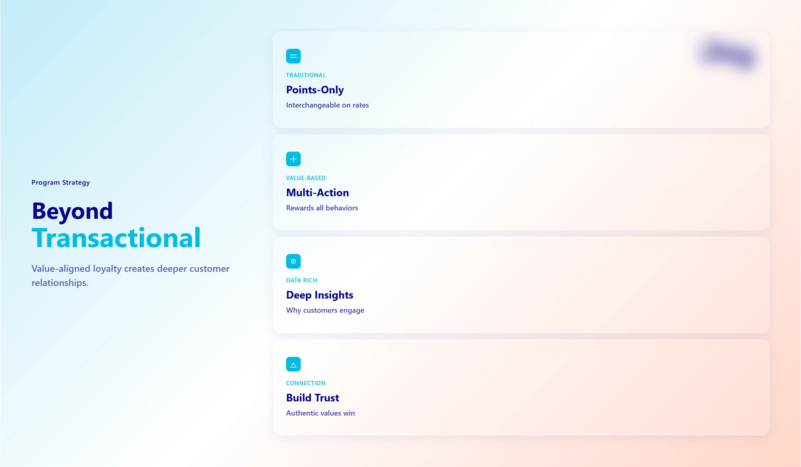
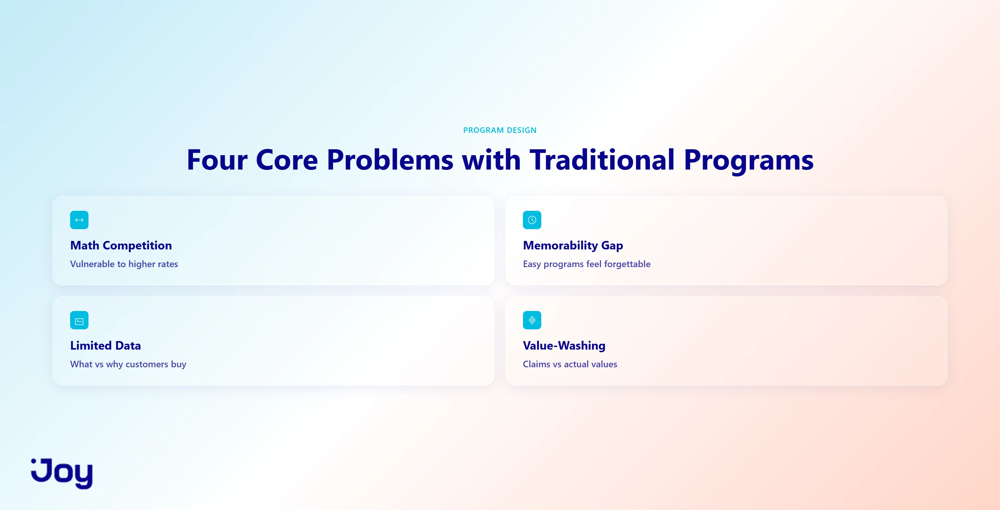
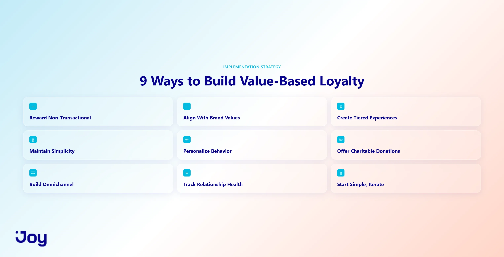

# Value-Based Loyalty Programs: 9 Strategies That Work

## Overview

This article examines how brands can move beyond traditional points-based loyalty programs to create deeper customer relationships through value-aligned rewards.

## Key Distinctions

**Traditional vs. Value-Based Programs:**

Traditional loyalty programs ask "How much did you spend?" while value-based approaches ask "How did you engage?" The latter rewards behaviors like reviews, referrals, social engagement, and milestone celebrations rather than purchases alone.

According to research cited, "54% of US online adults say loyalty programs influence what they buy."

## Four Core Problems with Traditional Points Programs

1. **Math Competition**: Programs become interchangeable when competing only on points rates, making them vulnerable to competitors offering better rates.

2. **Memorability Gap**: Simplicity doesn't guarantee stickiness. "77% of US online adults who belong to loyalty programs are more likely to participate if the program is easy to use," but easy programs can still feel forgettable without brand identity.

3. **Limited Data**: Traditional programs reveal what customers purchase but not why they engage, limiting segmentation and retention strategies.

4. **Value-Washing Risk**: Programs claiming shared values while only rewarding purchases erode trust rather than build it.

## Nine Implementation Strategies

### 1. Reward Non-Transactional Actions
- Product reviews, referrals, profile completion, social engagement
- Referred customers show "16% higher lifetime value" than non-referred ones
- Verify actions to prevent fraud

### 2. Align Rewards With Brand Values
Examples include:
- Outdoor brands: trade-in or trail cleanup points
- Beauty brands: recycling rewards
- Food brands: recipe-sharing incentives
- Fashion brands: sustainable shipping or donation points

### 3. Create Tiered Experiences Beyond Discounts
Include early product access, exclusive content, event invitations, and improved customer support rather than discount-only tiers.

### 4. Maintain Simplicity
Clear earning rules and redemption paths drive engagement. "Can a customer explain your program in one sentence?" serves as a litmus test.

### 5. Personalize Based on Behavior
Recommend relevant rewards, adjust earning prompts, and offer targeted anniversary/birthday rewards using collected behavioral data.

### 6. Offer Charitable Donation Options
Allow customers to convert points to charitable causes, signaling authentic shared values.

### 7. Build Omnichannel Consistency
Ensure consistent points balances and earning rates across online, mobile, and in-store channels.

### 8. Track Relationship Health Metrics
Monitor non-transactional earning rates, customer lifetime value by tier, repeat purchase rates, and referral conversion rates rather than just redemption.

### 9. Start Simple, Then Iterate
- Launch with 2-3 earning actions
- Offer 2-3 redemption options
- Track for 90 days before expanding
- Review quarterly, not weekly

## Launch Approach

The article recommends beginning with basic rewards for non-transactional actions like reviews or referrals, establishing clear point-to-value ratios, and iterating based on data before adding complexity.
