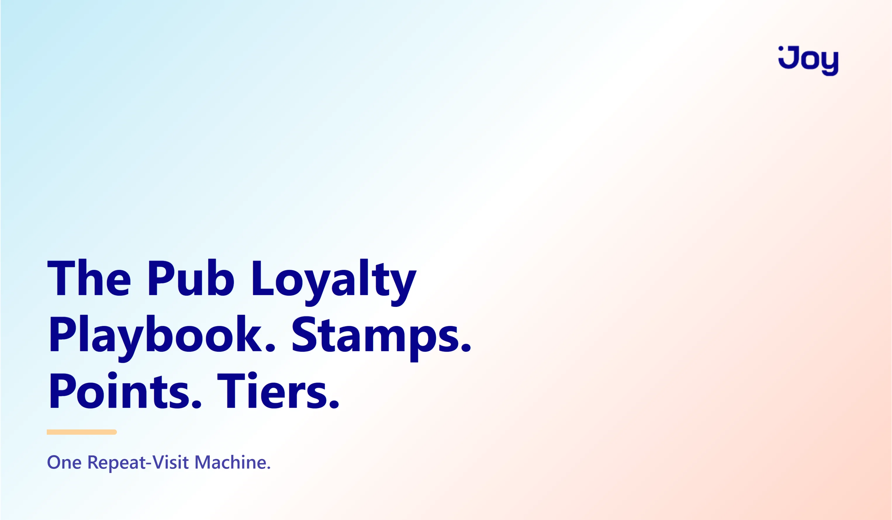
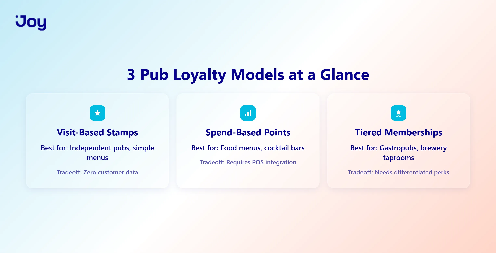
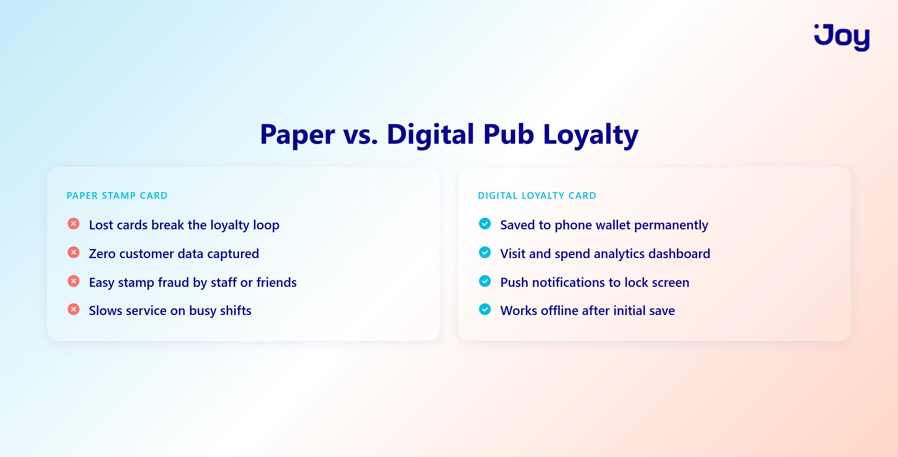
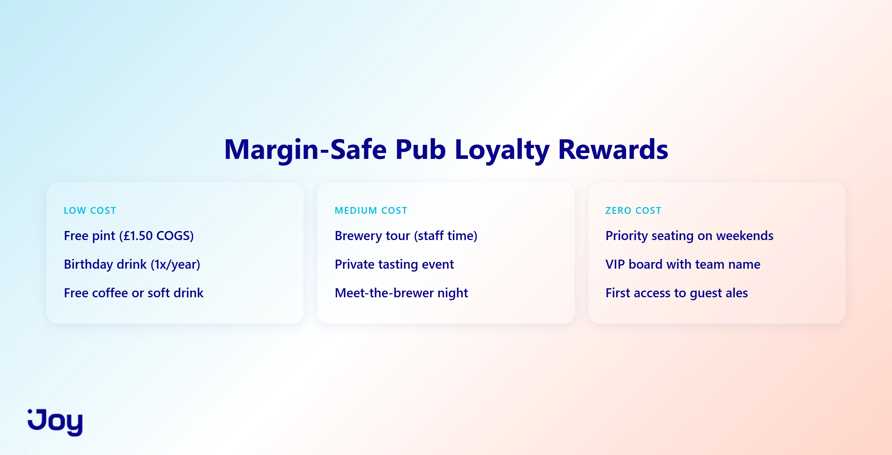
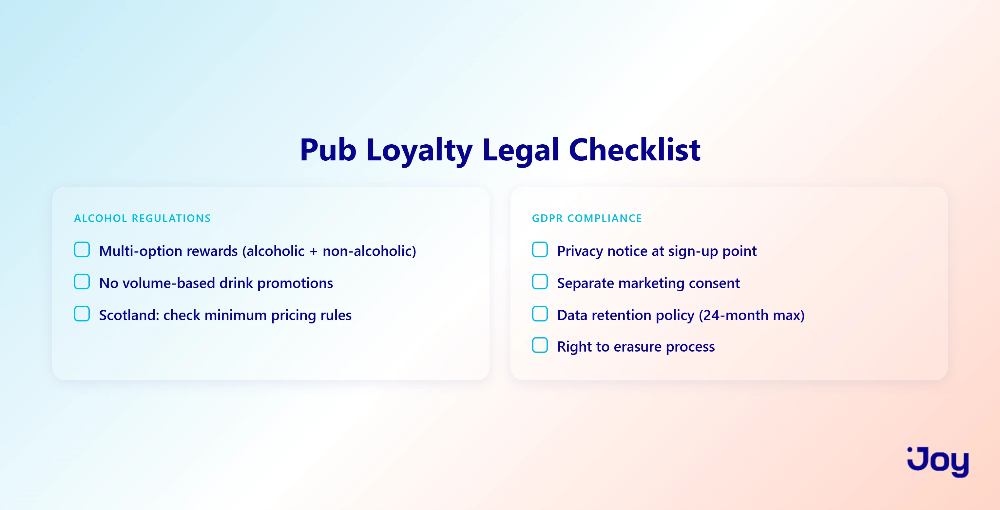

# Pub Loyalty Scheme: How to Build One That Drives Repeat Visits

The average UK pub competes with half a dozen venues within a 10-minute walk. In a market this saturated, the pubs that survive aren't the ones pouring the best pints. They're the ones customers return to by habit. And a pub loyalty scheme builds that habit deliberately.

Here's the problem most operators face: physical stamp cards still dominate. They give you zero customer data, disappear into coat pockets, and offer no insight into visit frequency or spend patterns. Put simply, you're rewarding loyalty you can't measure.

Yet the shift is already underway. Digital loyalty, from mobile wallet stamp cards to spend-based points and tiered memberships, delivers the data and automation that retail brands have used for years. Pubs that adopt it gain a decisive edge.

In this guide, we'll compare the three core mechanics (stamps vs. points vs. tiers), walk through real pub examples, cover the legal pitfalls that competitors ignore, including alcohol reward regulations and GDPR, and show you how to launch a scheme that protects margins while feeling generous to every regular who walks through your door.

**A well-designed pub loyalty scheme isn't a cost. It's the lowest-cost customer acquisition channel a pub can build, turning existing foot traffic into predictable repeat revenue.**

---

## What Is a Pub Loyalty Scheme? The 3 Models Every Operator Should Know

Before you print a single stamp card or configure a points engine, you need to pick the right loyalty mechanic for your venue. Three models dominate the pub and hospitality space, and each one offers a distinct tradeoff between simplicity and intelligence.

### Visit-Based Stamps: The Simplest Entry Point

A stamp-based pub loyalty scheme works exactly how it sounds. The customer gets one stamp per visit (or per qualifying purchase), and after a set number of stamps, they earn a reward like a free drink, a food item, or a discount.

Digital versions use Apple Wallet or Google Wallet. The customer scans a QR code at the bar, the stamp registers automatically, and the card lives on their phone. No app download. No account creation. No friction.

**Best for:** Independent pubs with simple menus, high walk-in traffic, and operators who want zero complexity.

The advantage here is speed, because customers join in seconds. However, the limitation is intelligence. Stamp cards tell you someone visited, but they don't tell you what they ordered, how much they spent, or when they stopped coming. You know they came, and that's about it.

### Spend-Based Points: Data-Rich and Margin-Friendly

Points programs tie rewards to spend. For example, 1 point per pound spent, with defined redemption thresholds like 100 points for a £5 reward. Every transaction is tracked through POS integration or digital ordering, so the customer identifies via phone number, app, or card tap.

**Best for:** Pubs with food menus, cocktail bars, or venues where average spend varies significantly between customers.

The advantage is data. You see basket size, visit frequency, peak hours, and your top-spending regulars. Because rewards scale proportionally, high-spenders earn more but they also spend more, which protects your margins. The tradeoff, though, is that points programs require POS integration or a digital ordering system. That means more setup than stamps.

**In other words, points programs turn every transaction into a data point. You stop guessing who your best customers are and start knowing.**

### Tiered Memberships: For Pubs With a Premium Play

Tiered programs create levels like Regular, Local, and VIP, based on visit count or total spend. As customers move up, higher tiers unlock better perks: priority seating, private events, first access to new cask releases, and tasting menus.

**Best for:** Gastropubs, brewery taprooms, or venue groups with genuinely differentiated premium experiences.

The advantage is aspiration. Customers see the next tier and visit more often to reach it, while VIP status drives word-of-mouth as members tell friends about their perks. That said, the limitation is real: tiers only work when each level unlocks something meaningfully different. If every tier just gets "10% off," the structure is cosmetic.

Joy supports all three models, including stamps (via custom actions), points (per-pound earning rules), and tiers (unlimited levels with automatic progression). So you can start with stamps and upgrade to points or tiers as you scale, all without switching platforms.

---

## Pub Loyalty Scheme: Paper vs. Digital and Why Stamp Cards Are Holding You Back

If your pub still runs a paper stamp card, you're operating with a 1990s tool in a 2026 market. Let's look at what that costs you, and what the digital alternative delivers instead.

### The Paper Stamp Card Problem: Lost Cards, Zero Data, Easy Fraud

Physical stamp cards fail in three predictable ways.

**Lost progress.** Customers lose cards all the time. Every lost card is a broken loyalty loop, because someone who was seven stamps toward a free pint now has to start over. Most don't bother.

**Zero data.** On top of that, paper cards capture nothing. You can't see visit frequency, peak times, average spend, or which customers churned last month. You're essentially running a rewards program with no feedback loop, rewarding behaviour you can't measure or replicate.

**Easy fraud.** Then there's the integrity problem. Friends stamp each other's cards. Staff give stamps without purchases. Customers claim they "forgot" their card and collect double stamps on their next visit. There's no audit trail and no accountability.

**Operational drag.** And during a packed Friday service, asking bar staff to find, stamp, and return a physical card slows every transaction. Even in basement bars or beer gardens with poor Wi-Fi where some digital solutions struggle, paper cards still don't solve the data problem.

### Digital Pub Loyalty Scheme: Mobile Wallet, No App Download

The fix isn't an app. It's a mobile wallet card.

Here's how it works. The customer scans a QR code at the bar, and a digital loyalty card saves directly to their Apple Wallet or Google Wallet. No app download, no account creation, no friction. Sign-up takes 15 seconds.

From there, each visit or qualifying purchase triggers a digital stamp via QR scan or NFC tap. The customer sees their stamp progress on their phone's lock screen, while the pub owner sees a dashboard with visit dates, redemption history, and customer analytics.

**Offline capability matters too.** Mobile wallet cards function without Wi-Fi after the initial save, which is critical for venues with spotty connectivity.

**Push notifications close the loop.** Messages like "You're 2 stamps away from a free pint" go directly to the customer's lock screen. No email open rate dependency. No app notification permission required.

For pubs that also sell online, whether that's merchandise, gift cards, or event tickets on Shopify, Joy connects in-store loyalty activity with online purchase data. The result is one unified customer profile across both channels.

---

## How to Design a Pub Loyalty Scheme That Protects Margins

Every pub owner asks the same question before launching a loyalty scheme: "Won't this eat my margins?" The answer depends entirely on how you design your rewards. When done right, a pub loyalty scheme costs less than most marketing channels and delivers more predictable returns.

### Reward Types That Work for Pubs: Beyond Free Pints

Free drinks are the default reward, and they're not a bad one. A free pint costs the pub roughly £1.50 to £2.50 in COGS but feels like a £5 to £6 reward to the customer. That perceived-value-to-actual-cost ratio is strong.

But the best margin play goes beyond pints. Consider rewards that cost you almost nothing:

- **Priority seating** on busy Friday and Saturday nights. Costs nothing, feels exclusive.
- **First access** to new cask ales or guest beers. Costs nothing, creates anticipation.
- **Pub quiz VIP board** with team name displayed permanently. Costs nothing, drives pride.
- **Birthday pint** once per year. Predictable cost, high emotional impact.
- **Experience rewards** like brewery tour tickets, meet-the-brewer nights, and private tasting events. These create memorable moments that fuel word-of-mouth, and they cost staff time rather than product.

Even better, let members choose. Offer a tiered reward menu with low-cost options (free coffee, soft drink) alongside aspirational ones (private event invite, brewery tour). Choice increases perceived value without increasing your cost.

### Earn/Burn Ratio: How to Set Points Without Bleeding Profit

The earn/burn ratio determines your actual loyalty cost. For example, if customers earn 1 point per £1 spent and 100 points equals a £5 reward, that's a 5% reward rate.

**As a rule of thumb,** keep your effective reward rate between 3% and 7% of customer spend. Below 3%, customers don't feel rewarded. Above 7%, you're eroding margins.

**Expiry mechanics also cap your exposure.** Points that never expire create a growing liability on your books. Instead, set a 6 to 12 month rolling expiry with a reminder notification 30 days before points lapse. This creates urgency to visit now or lose progress, and it keeps your cost predictable.

**Meanwhile, breakage works in your favour.** Not every customer redeems. Industry-standard breakage (unredeemed points) runs between 20% and 30%. Factor this into your model, because a 5% stated reward rate with natural breakage means your actual cost lands closer to 3.5% to 4% of revenue. That's less than most marketing spend.

### Fraud Prevention: Stopping Stamp Abuse and Point Gaming

Beyond reward design, digital systems also create accountability that paper never could.

**Common pub fraud includes** friends stamping each other's cards, staff giving stamps without purchases, and customers splitting one order into multiple small transactions to earn extra points.

**The digital prevention toolkit solves these:**
- Unique QR codes per transaction
- Staff PIN verification for each stamp
- Time-gating with one stamp per visit and a minimum 2-hour gap
- Minimum spend threshold per point-earning transaction
- Staff audit trail where every validated stamp logs which team member approved it

The bottom line: digital loyalty systems don't just prevent fraud. They create accountability for both customers and staff that paper cards never could.

Joy's earning rules engine lets merchants set custom point-per-pound ratios, minimum spend thresholds, and expiry windows, all configurable without code and adjustable in real time as you learn what works.

---

## Pub Loyalty Scheme Legal Pitfalls: Alcohol Regulations and GDPR

This is the section no one else covers. Two legal gaps can derail a pub loyalty scheme before it gains traction: alcohol reward regulations and data compliance. Ignore them, and you risk your licence or a regulatory fine.

### Alcohol Reward Regulations: Can You Give Away Free Drinks?

The UK Licensing Act 2003 prohibits irresponsible drink promotions. On top of that, the Mandatory Licensing Conditions (2014) specifically ban promotions that encourage excessive consumption.

Here's where it gets tricky. A "buy 9 pints, get 1 free" stamp card could be interpreted as encouraging volume drinking. The risk increases when the reward is exclusively an alcoholic drink with no alternative option.

**The safer approach is to offer choice.** "Redeem for a free pint OR a free soft drink OR a £5 food voucher." This demonstrates responsible promotion and protects your licence.

As a bonus, multi-option rewards also broaden your audience. Designated drivers, non-drinkers, and lunch-only visitors all find value in a scheme that doesn't assume everyone is there for alcohol.

**Scotland applies stricter scrutiny.** Under the Alcohol (Minimum Pricing) (Scotland) Act 2012, free alcohol promotions face additional regulatory oversight. If you operate in Scotland, review your reward structure with your licensing solicitor before launch.

**The takeaway: offering exclusively alcoholic rewards in a pub loyalty scheme is a licensing risk. Always include non-alcoholic or food alternatives.**

### GDPR Compliance: What Pub Operators Must Do When Collecting Customer Data

Any digital loyalty scheme collects personal data, including names, emails, phone numbers, visit history, and spend patterns. Under UK GDPR, this requires explicit consent and clear data governance.

**What you must have in place:**
- A clear privacy policy covering what data you collect, why, how long you retain it, and who accesses it
- Consent at sign-up through an opt-in checkbox (not pre-ticked)
- Right to erasure so customers can request deletion of their data at any time

**Here's the gap most pubs miss.** Using loyalty data for marketing, such as emails and SMS promotions, requires **separate** marketing consent. Signing up for the loyalty scheme does NOT automatically opt customers into marketing communications. These are two distinct permissions under GDPR.

**On data retention,** don't store customer data indefinitely. Set a retention period where 24 months of inactivity triggers automatic deletion. This caps your compliance risk and keeps your database clean.

**The practical step?** Add a one-paragraph privacy notice at your QR code sign-up point. One paragraph. That's the entire implementation.

Joy is built for GDPR-compliant markets. Consent management, data export, and customer deletion are all built into the platform, so merchants don't need to engineer compliance workflows manually.

---

## Real Pub Loyalty Scheme Examples: What Works in Practice

Theory is useful, but seeing it applied is better. Here are three pub loyalty scheme approaches at different scales, from a single independent pub to a multi-site brewery group to a modern gastropub with an online store.

### The Independent Pub: Simple Stamp Card Done Right

**The setup:** A single-location pub running a digital stamp card via mobile wallet. Ten stamps earns a free drink or £5 food credit, with a multi-option reward for licensing compliance.

**What drives sign-ups:** QR codes on every table and one at the bar. Staff trained with a single script: "Scan the QR to join our loyalty. You're halfway to a free round." No app download, 15-second sign-up.

**The result:** For the first time, regulars self-identify through the scheme. The pub owner sees visit frequency data, revealing that the top 20% of members visit three times per week. That insight alone changes how the pub allocates staff and stock on peak days.

**The lesson:** Start simple. A stamp card with one clear reward and zero-friction sign-up outperforms a complicated points system that nobody understands.

### The Brewery Taproom: Points + Exclusive Access

**The setup:** A craft brewery with three taproom locations running a points-based program. One point per £1 spent. 100 points gets £5 off. 250 points unlocks a brewery tour invite. And 500 points earns "Founder's Club" membership, which includes an annual tasting event plus name on the taproom wall.

**What drives engagement:** Points sync across all three locations, so a customer who visits Taproom A earns points redeemable at Taproom B. This multi-site syncing eliminates the "this card only works here" frustration that kills repeat visits at second and third locations.

**The aspiration layer:** The "Founder's Club" at 500 points creates a visible goal. Members see other names on the wall and want to join. It's social proof built into the venue itself.

**The lesson:** Multi-site pubs and brewery groups need loyalty data that syncs across locations. After all, customers don't think in terms of "which branch." They think in terms of "my local."

### The Modern Gastropub: Tiered Membership with Online Integration

**The setup:** A gastropub that sells branded merchandise, gift cards, and event tickets through a Shopify store alongside its dine-in operation. Three tiers: Regular (free to join), then Local (10+ visits), then VIP (25+ visits or £500+ annual spend).

**What drives retention:** VIP members get priority booking on Friday and Saturday nights, first access to seasonal tasting menus, and 10% off the online merch store. Because the online store is connected, loyalty extends beyond the physical venue. A VIP who buys merchandise online is still deepening their relationship with the brand.

**The data advantage:** The pub sees which VIP members also purchase online, enabling cross-channel campaigns like "Your VIP status gives you early access to our new merch drop." In-venue loyalty and ecommerce data feed the same customer profile.

**The lesson:** For pubs with an online presence, connecting in-venue loyalty to ecommerce data creates a complete customer picture that neither channel delivers alone.

This gastropub example is where Joy shines. By connecting Shopify online store data (merch purchases, gift cards, event tickets) with in-venue loyalty activity into one unified customer profile, Joy powers cross-channel campaigns and repeat revenue.

---

## How to Launch Your Pub Loyalty Scheme: A 4-Week Rollout Plan

You've chosen your model, designed your rewards, and checked the legal boxes. Now it's time to execute. This 4-week rollout turns your pub loyalty scheme from a plan into a running program.

### Week 1 to 2: Choose Your Model and Set Up

**Start by picking your mechanic.** Use the three-model framework from Section 1. Most independent pubs should start with digital stamps, while multi-site venues or gastropubs with online stores should consider points or tiers.

**Then work through the setup checklist:**
1. Choose a loyalty platform
2. Configure earning rules, either stamps per visit or points per £1 spent
3. Set reward(s) with multi-option choice for licensing compliance (see Section 4)
4. Design the QR code sign-up flow
5. Write a one-paragraph privacy notice for GDPR compliance

**Next, train every staff member.** Each person behind the bar should be able to explain the scheme in one sentence and prompt customers to join. Example script: *"We've just launched our loyalty. Scan the QR on your table, and your 10th visit earns you a free drink or food credit."*

**Finally, test internally first.** Run the scheme with staff for 3 to 5 days before public launch. Identify friction points like slow QR loading, confusing reward language, or unclear sign-up flow, and fix them before customers see them.

A pub loyalty scheme should take days to set up, not weeks. If your platform requires more than a week of configuration, it's too complex for hospitality.

### Week 3 to 4: Launch, Promote, and Optimise

**On launch day, go visible everywhere:**
- QR codes on every table, bar top, and receipt
- A-frame sign at the entrance
- Social media announcement: "Join today and get your first stamp free"

**Remember that staff are your number one promotion channel.** Every transaction is a prompt opportunity. Incentivise the team by offering a prize for the staff member who signs up the most members that month. Staff enthusiasm directly determines sign-up velocity.

**By week 3, measure and fix.** Review sign-up rate, stamp and point activity, and customer feedback. The most common issue is QR codes that are too small or poorly placed. The fix is simple: print larger and position at eye level at the bar.

**In week 4, optimise your rewards.** Look at your redemption rate. If nobody is redeeming, the reward feels too far away, so lower the threshold. If everyone redeems immediately, the threshold is too low, so raise it or introduce a second, higher-tier reward.

The first month isn't about perfection. It's about learning. Launch fast, measure everything, and adjust based on real customer behaviour rather than assumptions.

Joy's dashboard delivers real-time analytics on sign-ups, point activity, and redemption rates. That means pub operators can make week 3 to 4 adjustments from their phone without waiting for monthly reports.

---

## Your Pub Loyalty Scheme Starts With One Decision

Stamps for simplicity. Points for data. Tiers for aspiration. Most pubs should start with digital stamps and upgrade as they learn what their customers respond to.

Build on a legal foundation from day one. That means multi-option rewards, both alcoholic and non-alcoholic, for licensing compliance. Plus a privacy notice and explicit consent for GDPR. These aren't optional extras. They're table stakes.

The real ROI of a pub loyalty scheme isn't free pints redeemed. It's intelligence. You gain data on who your customers are, when they visit, what they spend, and, critically, when they stop coming. That insight is worth more than any single reward.

For pubs with a Shopify store selling merchandise, gift cards, or event tickets, [Joy](https://joy.so) connects your in-venue loyalty data with your online sales. One customer profile. One loyalty engine. One place to see everything.

The best time to launch a pub loyalty scheme was five years ago. The second best time is this week.
